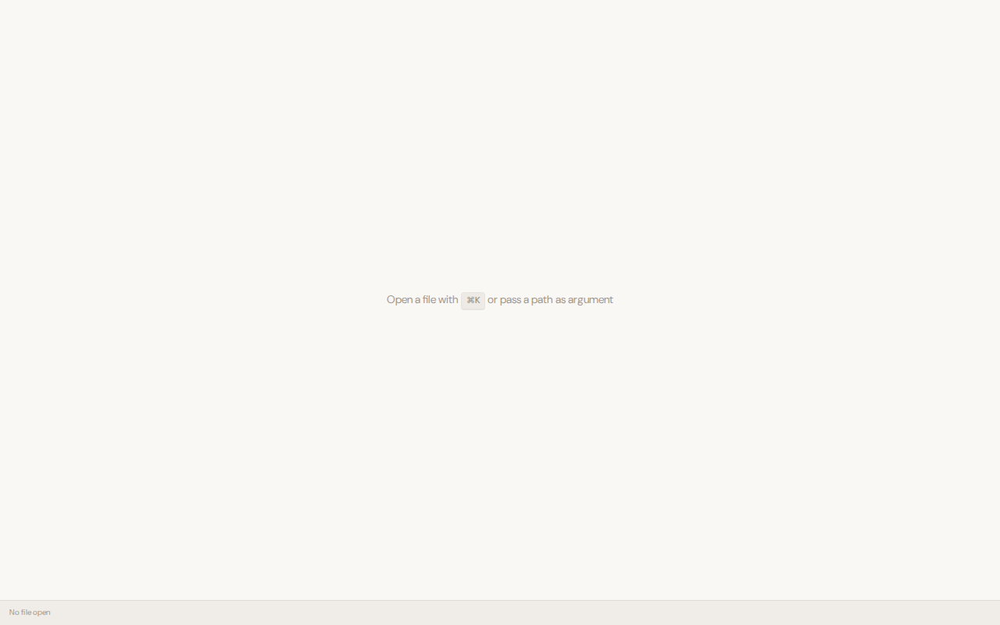

# Dogfood Report: mpad

| Field | Value |
|-------|-------|
| **Date** | 2025-03-09 |
| **App** | mpad (Tauri v2 desktop Markdown editor) |
| **Scope** | Full app — editor, sidebar, command palette, shortcuts, git integration |

## Summary

| Severity | Count |
|----------|-------|
| Critical | 0 |
| High | 1 |
| Medium | 0 |
| Low | 2 |
| **Total** | **3** |

## Issues

### ISSUE-001: Page title says "mdview" instead of "mpad"

| Field | Value |
|-------|-------|
| **Severity** | low |
| **Category** | content |
| **Location** | Browser tab / window title on app load |

**Description**

The HTML document title in `index.html` is set to "mdview". The application is named "mpad" (per README, CLAUDE.md, package.json). Users see "mdview" in the taskbar/window title.

**Evidence**



**Repro**

1. Run `npm run dev` (or open the app)
2. Observe the window/tab title — shows "mdview"

---

### ISSUE-002: Rust build fails on Cargo 1.82 (edition2024)

| Field | Value |
|-------|-------|
| **Severity** | high |
| **Category** | functional |
| **Location** | `npm run check:rust` / `cargo build` |

**Description**

Build fails with: `feature 'edition2024' is required` (from transitive `time-core` crate). Cargo 1.82 does not support edition2024. Blocks development and CI on older Rust toolchains.

**Repro**

1. Use Rust/Cargo 1.82 (e.g. default on some Linux distros)
2. Run `npm run check:rust` or `cd src-tauri && cargo build`
3. **Observe:** Build fails parsing time-core manifest

**Output**

```
error: failed to parse manifest at `.../time-core-0.1.8/Cargo.toml`
  feature `edition2024` is required
  ... not stabilized in this version of Cargo (1.82.0)
```

---

### ISSUE-003: Shortcut hint uses Mac-only ⌘ on all platforms

| Field | Value |
|-------|-------|
| **Severity** | low |
| **Category** | ux |
| **Location** | Empty state, command palette shortcuts |

**Description**

Empty state shows "Open a file with ⌘K"; command palette shows ⌘S, ⌘O, etc. On Linux/Windows, the modifier is typically Ctrl or Win, not ⌘. Users may look for Ctrl+K and not find the right shortcut.

**Evidence**


**Repro**

1. Open app (no file loaded)
2. See "⌘K" in the empty-state hint
3. On Linux/Windows, user expects "Ctrl+K" or platform-appropriate symbol

---

## Exploration Notes

- **Frontend:** Vite dev server runs; React app loads with no console errors.
- **Tests:** 55 Vitest tests pass (fuzzyMatch, taskList, Editor).
- **Tauri:** Full native app could not be launched in this environment (Rust build blocked).
- **Browser-only:** App handles missing Tauri backend gracefully — shows empty state, no JS crashes.
