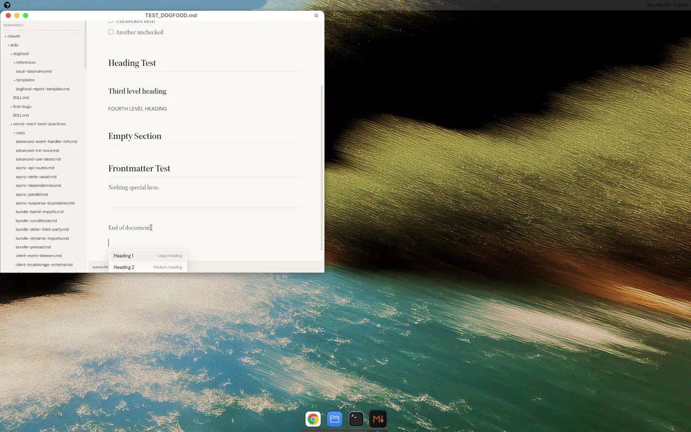
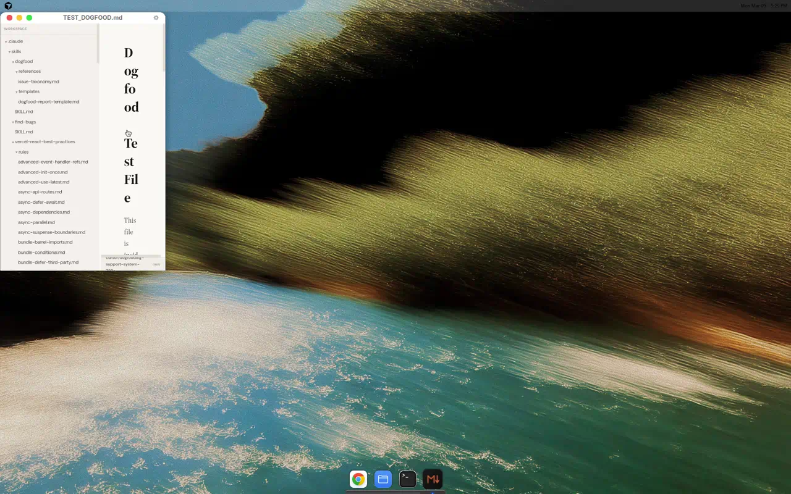

# Dogfood Report: mpad

| Field | Value |
|-------|-------|
| **Date** | 2026-03-09 |
| **App URL** | Tauri desktop app (dev mode: localhost:5173) |
| **Scope** | Full app: editor, sidebar, shortcuts, git features, command palette |

## Summary

| Severity | Count |
|----------|-------|
| Critical | 2 |
| High | 1 |
| Medium | 2 |
| Low | 2 |
| **Total** | **7** |

## Issues

### ISSUE-001: Checked task list items invisible in WYSIWYG mode

| Field | Value |
|-------|-------|
| **Severity** | critical |
| **Category** | functional |
| **URL** | Any markdown file with `[x]` task items |

**Description**

Task list items marked as checked (`- [x] item`) in the markdown source are completely invisible in WYSIWYG mode. The items exist in source view (Ctrl+/) but are entirely absent from the rendered WYSIWYG output. Only unchecked items (`- [ ] item`) render.

**Repro Steps**

1. Open a markdown file with both checked and unchecked task items:
   ```
   - [ ] Unchecked item
   - [x] Checked item 1
   - [x] Checked item 2
   - [ ] Another unchecked
   ```
   

2. Only 2 unchecked items appear. The 2 checked items are completely missing.

3. Press Ctrl+/ to toggle source view
   ![Step 3 - Source shows all 4 items including [x]](screenshots/issue-001-source-view-all-items.webp)

4. All 4 items visible in source including `[x] Checked item 1` and `[x] Checked item 2`

5. Press Ctrl+/ to go back to WYSIWYG
   

6. **Observe:** Checked items are gone again. Reproducible 100% of the time.

---

### ISSUE-002: Checkbox click state does not persist

| Field | Value |
|-------|-------|
| **Severity** | critical |
| **Category** | functional |
| **URL** | Any markdown file with task list items |

**Description**

Clicking a checkbox in the WYSIWYG editor visually toggles it (checkmark appears), but the state reverts to unchecked after scrolling away and back. The checked state is not saved to the document model or file. Related to ISSUE-001 — the WYSIWYG renderer drops checked task items.

**Repro Steps**

1. Open TEST_DOGFOOD.md, see unchecked task items
2. Click the checkbox next to "Unchecked item" — it toggles to checked (✅ appears)
   
3. Scroll down and back up
4. **Observe:** The checkbox has reverted to unchecked state

---

### ISSUE-003: TypeScript build error in SearchHighlight.ts

| Field | Value |
|-------|-------|
| **Severity** | high |
| **Category** | functional |
| **URL** | `src/extensions/SearchHighlight.ts` |

**Description**

Running `bun run build` (`tsc -b && vite build`) fails with TypeScript error TS18047: `'doc' is possibly 'null'` in `SearchHighlight.ts` line 18. The `findMatches` function parameter `doc` uses a type derived from `nodeAt` which returns `Node | null`, but the function body calls `doc.descendants()` without null check.

**Repro Steps**

1. Run `bun run build` from workspace root
2. **Observe:** Build fails:
   ```
   src/extensions/SearchHighlight.ts(18,3): error TS18047: 'doc' is possibly 'null'.
   ```
3. Fix: Change type annotation to `import('@tiptap/pm/model').Node` instead of `ReturnType<typeof ...nodeAt>`.

---

### ISSUE-004: Save serialization adds extra blank lines between task list items

| Field | Value |
|-------|-------|
| **Severity** | medium |
| **Category** | functional |
| **URL** | Any file with task lists |

**Description**

When a file with tight task list items (no blank lines between items) is loaded and saved, the tiptap-markdown serializer converts them to loose list format (blank lines between each item). This changes the markdown structure and may affect rendering in other markdown viewers.

**Repro Steps**

1. Create a file with tight task list:
   ```
   - [ ] Item 1
   - [x] Item 2
   - [ ] Item 3
   ```
2. Open in mpad, press Ctrl+S
3. **Observe:** Saved file now has blank lines between items:
   ```
   - [ ] Item 1

   - [x] Item 2

   - [ ] Item 3
   ```

---

### ISSUE-005: Slash command menu is limited to only 2 options

| Field | Value |
|-------|-------|
| **Severity** | medium |
| **Category** | ux |
| **URL** | Any editor view |

**Description**

The slash command menu (triggered by typing `/` on an empty line) only offers "Heading 1" and "Heading 2". Missing common commands like bullet list, numbered list, code block, blockquote, horizontal rule, task list, image, etc.

**Repro Steps**

1. Click at the end of a document, press Enter for a new line
2. Type `/` to trigger slash commands
   
3. **Observe:** Only "Heading 1 (Large heading)" and "Heading 2 (Medium heading)" appear

---

### ISSUE-006: No visual feedback on save (Ctrl+S)

| Field | Value |
|-------|-------|
| **Severity** | low |
| **Category** | ux |
| **URL** | Any editor view |

**Description**

Pressing Ctrl+S to save shows no visual confirmation (no toast, no status bar change, no title bar indicator). Users have no way to know if the save succeeded or failed without checking the file externally.

**Repro Steps**

1. Make an edit to the document
2. Press Ctrl+S
3. **Observe:** No visual feedback — no toast/notification, no status bar update, no title bar change

---

### ISSUE-007: Sidebar does not collapse at narrow window widths

| Field | Value |
|-------|-------|
| **Severity** | low |
| **Category** | ux |
| **URL** | Any view with sidebar open |

**Description**

When the window is resized to very narrow widths (~350px) with the sidebar open, the sidebar takes up most of the horizontal space, leaving the editor area with only ~100px width. Heading text wraps character-by-character, making the editor unusable. The sidebar should auto-collapse below a threshold width.

**Repro Steps**

1. Open sidebar with Ctrl+B
2. Resize window to ~350px wide
   
3. **Observe:** "Dogfood Test File" heading wraps to display each word/syllable on a separate line. Editor is unusable.

---

## Working Features

| Feature | Status | Notes |
|---------|--------|-------|
| Editor (WYSIWYG) | ✅ | Renders headings, bold, italic, lists, code blocks, tables, blockquotes |
| Source view toggle | ✅ | Ctrl+/ seamlessly switches views |
| Sidebar file tree | ✅ | Shows markdown files in git repo with directory structure |
| Command palette | ✅ | Ctrl+K with fuzzy search for files and commands |
| Git log | ✅ | Ctrl+L shows commit history |
| Diff view | ✅ | Ctrl+D shows git diff panel |
| Bubble menu | ✅ | Text selection shows B/I/S/Code/H/Link formatting options |
| Heading cycle | ✅ | Ctrl+Shift+Up/Down cycles heading levels |
| Search (Ctrl+F) | ✅ | Find bar with match navigation |
| Open file dialog | ✅ | Native file picker with markdown filter |
| Save (Ctrl+S) | ✅ | Saves file correctly (but no visual feedback) |
| Undo (Ctrl+Z) | ✅ | Reverts edits correctly |
| Syntax highlighting | ✅ | Code blocks have proper syntax coloring |
| Zoom (Ctrl++/-/0) | ✅ | Available in command palette |
