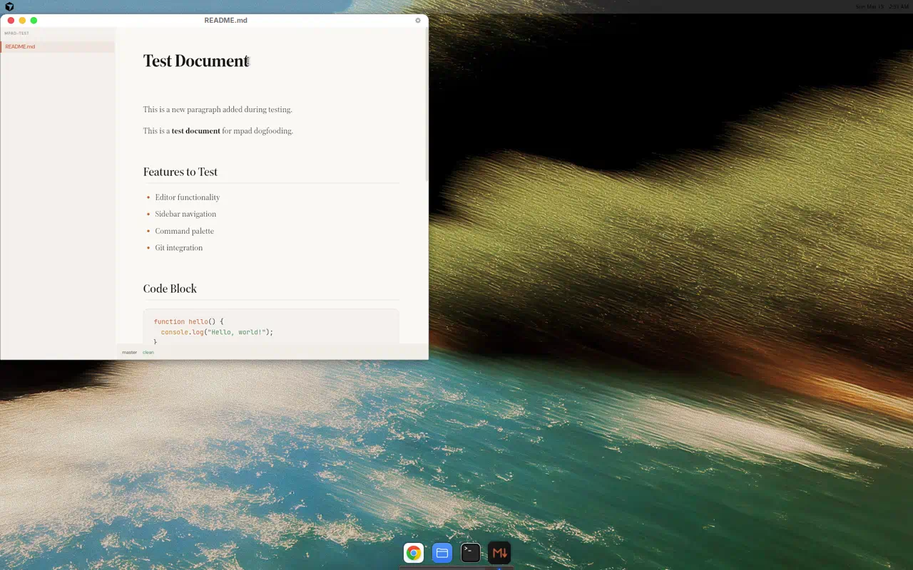
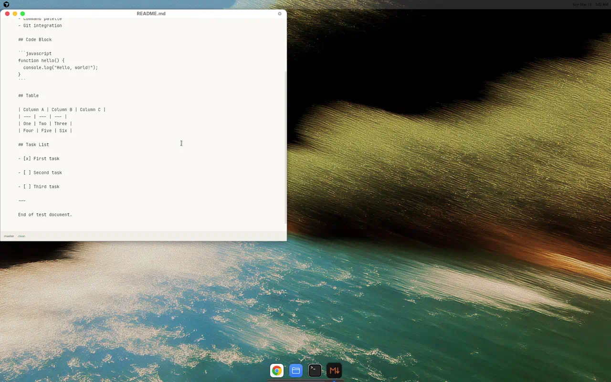
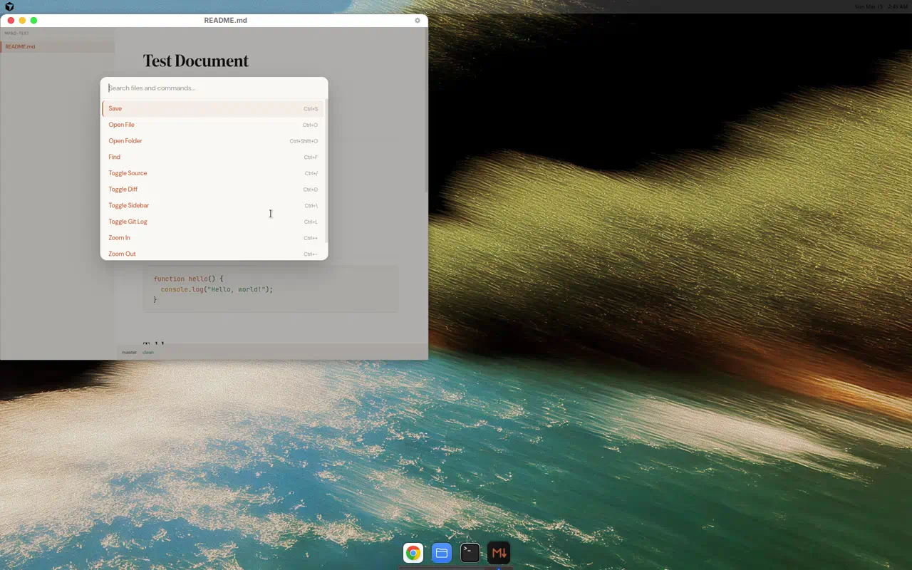
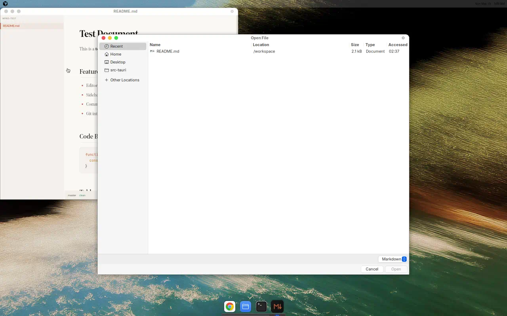

# Dogfood Report: mpad

| Field | Value |
|-------|-------|
| **Date** | 2026-03-15 |
| **App URL** | Tauri desktop app (dev mode, localhost:5173) |
| **Scope** | Full app — editor, sidebar, command palette, git features, file operations |

## Summary

| Severity | Count |
|----------|-------|
| Critical | 0 |
| High | 1 |
| Medium | 2 |
| Low | 2 |
| **Total** | **5** |

## Issues

### ISSUE-001: Git status bar not refreshed after save — shows "clean" for modified files

| Field | Value |
|-------|-------|
| **Severity** | high |
| **Category** | functional |
| **URL** | Status bar (bottom-left of editor window) |

**Description**

After editing and saving a file, the status bar continues to show "clean" even though `git status` reports the file as `modified`. The status bar correctly shows "new" for untracked files (verified with notes.md), so it CAN display file-specific git status. But saves don't trigger a git status refresh, leaving stale "clean" status after modifications.

**Expected:** Status bar shows "modified" after saving changes that differ from HEAD.
**Actual:** Status bar shows "clean" regardless of git working tree state after save.

**Repro Steps**

1. Open a committed markdown file in mpad
   

2. Edit the document (add any text) and save with Ctrl+S

3. Observe the status bar at bottom-left still shows "master  clean"
   

4. Verify via terminal: `git status` reports `modified: README.md`

5. Compare with notes.md (untracked file) which correctly shows "master  new"
   

---

### ISSUE-002: Lossy round-trip — table separator format normalized on open+save

| Field | Value |
|-------|-------|
| **Severity** | medium |
| **Category** | functional |
| **URL** | Any markdown file containing tables |

**Description**

Opening and saving a file — even WITHOUT making any edits — changes the table separator row format. The original `|----------|----------|----------|` is normalized to `| --- | --- | --- |`. Both are valid markdown, but the transformation creates unexpected git diffs in version-controlled files. This violates the principle that opening and saving a file without changes should be a no-op.

**Expected:** Save without edits produces byte-identical file.
**Actual:** Table separator syntax silently changed, producing a git diff.

**Repro Steps**

1. Create a markdown file with a table using long separator dashes: `|----------|----------|----------|`
2. Commit it to git
3. Open the file in mpad (no edits needed)
4. Save with Ctrl+S
5. Run `git diff` — observe the table separator changed:
   ```
   -|----------|----------|----------|
   +| --- | --- | --- |
   ```
   

---

### ISSUE-003: Lossy round-trip — blank lines injected between task list items

| Field | Value |
|-------|-------|
| **Severity** | medium |
| **Category** | functional |
| **URL** | Any markdown file containing task lists |

**Description**

Opening and saving a file inserts extra blank lines between task list items, converting tight lists to loose lists. This changes how the list renders in other markdown parsers (loose lists get `<p>` wrappers) and creates unwanted git diffs.

**Expected:** Tight task list items remain compact (no blank lines between them).
**Actual:** Blank lines inserted between each task list item on save.

**Repro Steps**

1. Create a markdown file with tight task list items (no blank lines between them):
   ```
   - [x] First task
   - [ ] Second task
   - [ ] Third task
   ```
2. Commit to git
3. Open file in mpad, save immediately with Ctrl+S (no edits needed)
4. Run `git diff` — observe blank lines inserted:
   ```
    - [x] First task
   +
    - [ ] Second task
   +
    - [ ] Third task
   ```
   

---

### ISSUE-004: No "New File" command in UI

| Field | Value |
|-------|-------|
| **Severity** | low |
| **Category** | ux |
| **URL** | Command palette (Ctrl+K) |

**Description**

There is no way to create a new markdown file from within the app. The command palette offers Save, Open File, Open Folder, Find, and toggle commands — but no "New File" or "Create File" option. Users must create files externally (terminal, file manager) and then open them. For an editor optimized for agent skills files, quickly creating new `.md` files is a common workflow.

**Expected:** A "New File" command in the command palette or a context menu option in the sidebar.
**Actual:** No file creation mechanism. Users must exit the app to create files.

**Repro Steps**

1. Open command palette with Ctrl+K
   

2. Observe available commands: Save, Open File, Open Folder, Find, Toggle Source, Toggle Diff, Toggle Sidebar, Toggle Git Log, Zoom In, Zoom Out — no "New File"

---

### ISSUE-005: File picker dialog doesn't default to current file's directory

| Field | Value |
|-------|-------|
| **Severity** | low |
| **Category** | ux |
| **URL** | Open File dialog (Ctrl+O) |

**Description**

When using "Open File" (Ctrl+O), the file picker dialog opens showing "Recent" files from the system rather than defaulting to the directory of the currently open file. When editing `/tmp/mpad-test/README.md`, the dialog shows files from `/workspace` (the system's recent location). Users must manually navigate to the correct directory each time.

**Expected:** File picker opens in the same directory as the currently loaded file.
**Actual:** File picker opens to system "Recent" location.

**Repro Steps**

1. Open `/tmp/mpad-test/README.md` in mpad
2. Press Ctrl+O or use command palette → "Open File"
3. Observe the file picker dialog shows "Recent" files from `/workspace`, not from `/tmp/mpad-test/`
   

---
