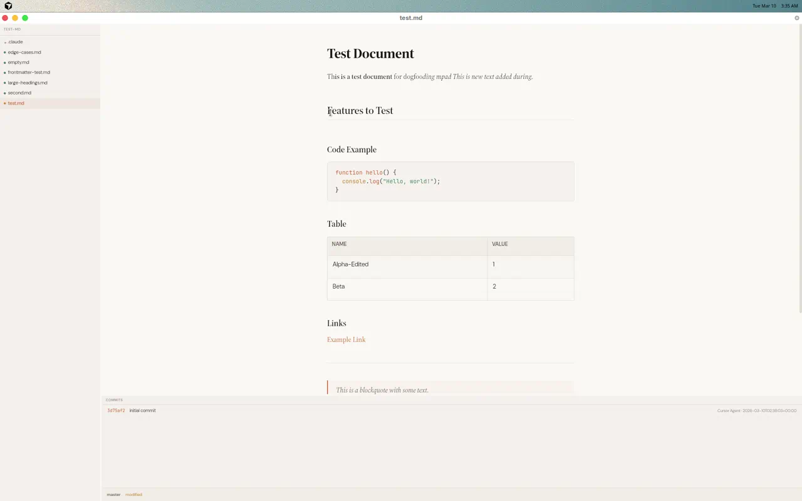
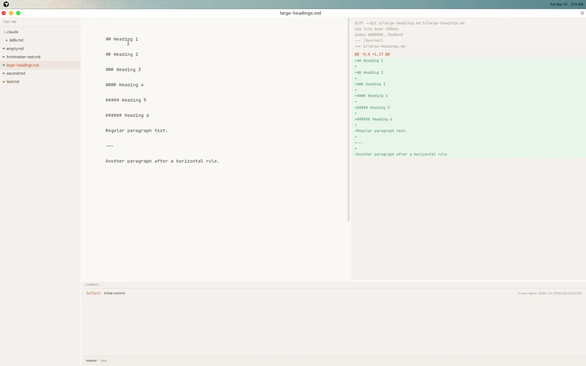
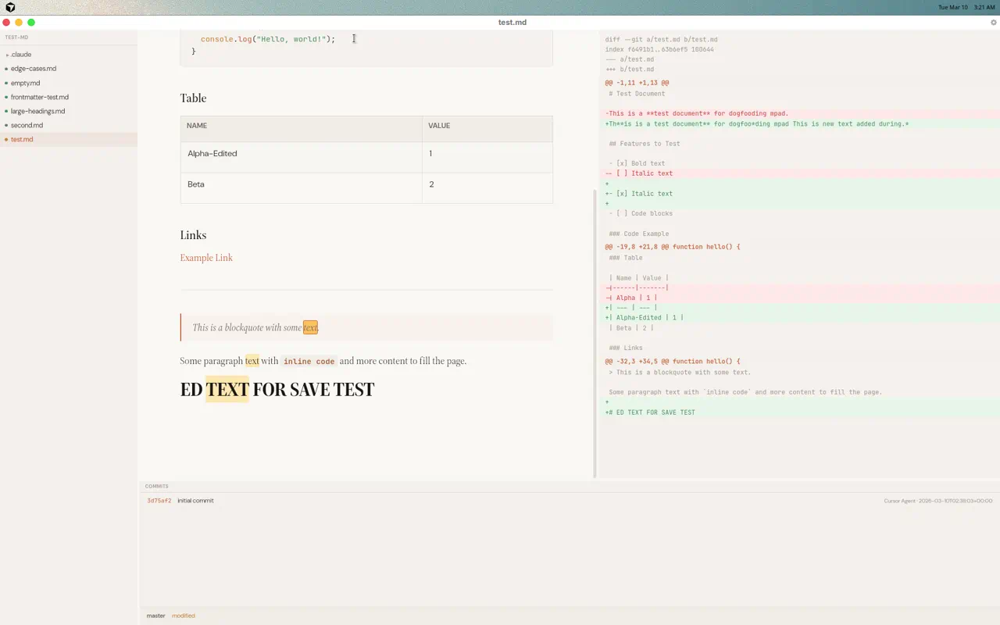
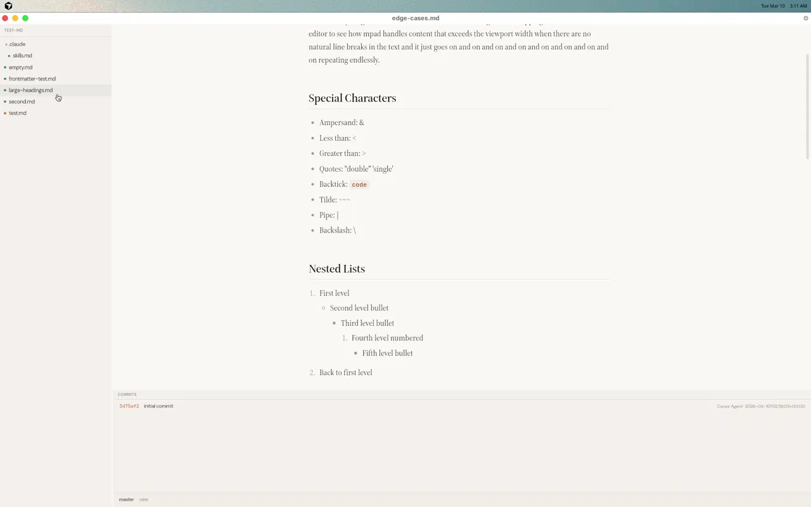
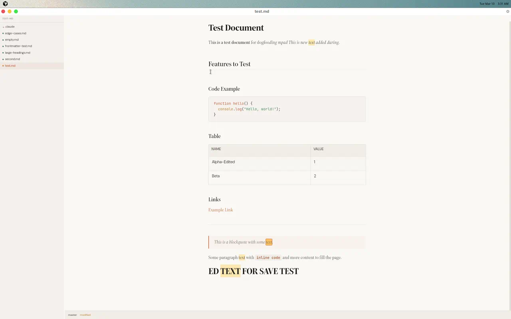
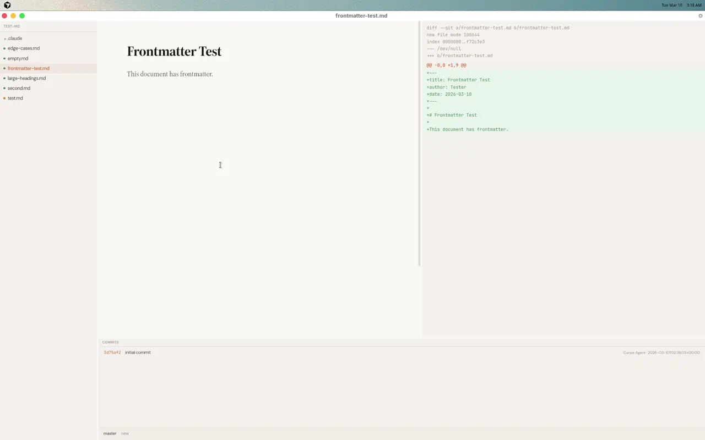

# Dogfood Report: mpad

| Field | Value |
|-------|-------|
| **Date** | 2026-03-10 |
| **App URL** | Tauri desktop app (DISPLAY=:1) |
| **Scope** | Full app — editor, sidebar, shortcuts, git features, search |

## Summary

| Severity | Count |
|----------|-------|
| Critical | 1 |
| High | 2 |
| Medium | 3 |
| Low | 2 |
| **Total** | **8** |

## Issues

---

### ISSUE-001: Search highlights persist after closing search bar

| Field | Value |
|-------|-------|
| **Severity** | critical |
| **Category** | functional |
| **URL** | Any file with Ctrl+F search |

**Description**

After searching (Ctrl+F → type query → Enter to navigate) and pressing Escape to close the search bar, all orange/yellow search highlight decorations remain visible indefinitely. They persist through scrolling, zooming, toggling diff panel, and even switching files. The only way to clear them is to reopen search (Ctrl+F), clear the query, and close again — but this is not discoverable.

Root cause analysis: The `FindBar.handleClose` calls `clearSearch(editor)` which sets `storage.query = ''` and dispatches a transaction. The `SearchHighlight` plugin's `apply` should return `DecorationSet.empty` when query is empty. However, the bug reproduces intermittently, suggesting a race condition between React state batching (unmounting FindBar via `showFind=false`) and ProseMirror's decoration reconciliation.

Additionally, the FindBar's Escape handler only fires when the input is focused. If the user clicks in the editor first (common after searching), Escape won't reach the FindBar — there's no global Escape handler for the find bar.

**Repro Steps**

1. Open any file in mpad
2. Press Ctrl+F to open the search bar
3. Type a query that matches multiple times (e.g., "text")
4. Press Enter to navigate to matches
5. Press Escape to close the search bar
6. **Observe:** Orange/yellow highlights remain visible on all matched text
   

---

### ISSUE-002: Heading cycle keyboard shortcuts non-functional

| Field | Value |
|-------|-------|
| **Severity** | high |
| **Category** | functional |
| **URL** | Any file with headings |

**Description**

The documented Ctrl+Shift+ArrowUp and Ctrl+Shift+ArrowDown shortcuts for cycling heading levels do nothing. The `HeadingCycle` TipTap extension is defined in `Editor.tsx` with `Mod-Shift-ArrowUp/Down` bindings, but the shortcuts have zero effect on headings or paragraphs.

Likely cause: On Linux (WebKitGTK), Ctrl+Shift+ArrowUp/Down may be intercepted by the window manager or the WebKit layer before reaching ProseMirror's key handler. This keyboard shortcut conflict means the TipTap extension never receives the event.

**Repro Steps**

1. Open large-headings.md (or any file with headings)
2. Click on an H1 heading to place cursor
3. Press Ctrl+Shift+ArrowDown
4. **Observe:** Heading level does not change (should go from H1 to H2)
   
5. Press Ctrl+/ to toggle source mode — confirms markdown is still `# Heading 1`

---

### ISSUE-003: Find bar scrolls out of view when navigating matches

| Field | Value |
|-------|-------|
| **Severity** | high |
| **Category** | ux |
| **URL** | Any file with Ctrl+F search |

**Description**

The FindBar component is rendered inside `.editor-area` (which has `overflow-y: auto`) as a normal flow element. When navigating to a match that's below the viewport, `scrollIntoView` scrolls the `.editor-area` container, pushing the FindBar out of view. The search bar CSS lacks `position: sticky; top: 0`.

This bug is intermittent depending on the document length and match positions — it only occurs when `scrollIntoView` moves the scroll container enough to hide the FindBar.

**Repro Steps**

1. Open a file with content longer than the viewport
2. Press Ctrl+F and type a query
3. Press Enter multiple times to navigate to matches lower in the document
4. **Observe:** The search bar may scroll out of view
   

**Fix:** Add `position: sticky; top: 0; z-index: 10;` to `.find-bar` in `editor.css`

---

### ISSUE-004: Sidebar file list does not auto-refresh for new files

| Field | Value |
|-------|-------|
| **Severity** | medium |
| **Category** | functional |
| **URL** | Sidebar file tree |

**Description**

Files created externally after the app starts do not appear in the sidebar or command palette (Ctrl+K). The sidebar's `useEffect` only fires when `repoPath` changes — it doesn't watch the filesystem for new files. 

Workaround: Toggle sidebar off/on (Ctrl+B twice) to force a re-fetch, but this is not discoverable.

**Repro Steps**

1. Start mpad with a directory open
2. Create a new .md file in the same directory (from terminal)
3. Open sidebar (Ctrl+B) and look for the new file
4. **Observe:** New file is missing from the sidebar file tree
   
5. Toggle sidebar off/on (Ctrl+B twice) — file appears after re-toggle

---

### ISSUE-005: Checked task list items animate to invisible

| Field | Value |
|-------|-------|
| **Severity** | medium |
| **Category** | ux |
| **URL** | Any file with task lists |

**Description**

When a task list checkbox is checked, the entire list item animates to `opacity: 0` and `max-height: 0`, effectively disappearing from view. While technically intentional (CSS comment says "Checked task items animate out"), this is surprising and potentially destructive UX — users expect checked items to remain visible with a strikethrough or checked appearance, not vanish entirely.

The items still exist in the markdown source. Ctrl+Z (undo) can bring them back, and toggling source mode shows them. But for a markdown editor focused on writing/editing, disappearing content is alarming.

**Repro Steps**

1. Open a file with unchecked task list items (e.g., `- [ ] Item`)
2. Click a checkbox to check it
3. **Observe:** The item animates away over ~700ms and completely disappears
   

---

### ISSUE-006: .claude/ directory does not auto-expand in sidebar

| Field | Value |
|-------|-------|
| **Severity** | medium |
| **Category** | functional |
| **URL** | Sidebar |

**Description**

CLAUDE.md documents that `.claude/`, `.cursor/`, `.agents/` directories auto-expand in the sidebar. The code at `Sidebar.tsx:113-118` has logic for this (`depth < 1 || root === '.claude'`), but in practice the `.claude/` folder appeared collapsed after sidebar toggle, requiring manual expansion.

The `useState` initializer should return `true` for depth-0 items, so all root-level directories should start expanded. This may be a React state management issue on remount, or the initial state calculation may not be triggering as expected.

**Repro Steps**

1. Open mpad in a directory that contains a `.claude/` folder
2. Toggle sidebar on (Ctrl+B)
3. **Observe:** `.claude/` appears collapsed with a ► arrow
   
4. Click `.claude/` to expand — it opens and shows nested files

---

### ISSUE-007: Tab key does nothing; Shift+Tab scrolls to top

| Field | Value |
|-------|-------|
| **Severity** | low |
| **Category** | ux |
| **URL** | Editor area |

**Description**

Pressing Tab in the editor has no visible effect (no indentation, no focus change). Pressing Shift+Tab unexpectedly scrolls the editor to the top of the document. In a markdown editor, Tab should either insert indentation (especially in code blocks and lists) or be handled gracefully.

**Repro Steps**

1. Click in the editor to place cursor
2. Press Tab — nothing visible happens
3. Press Shift+Tab
4. **Observe:** Editor scrolls to top of document

---

### ISSUE-008: No visual save confirmation feedback

| Field | Value |
|-------|-------|
| **Severity** | low |
| **Category** | ux |
| **URL** | Editor |

**Description**

When pressing Ctrl+S to save, there is no visual feedback that the save succeeded — no toast notification, no title bar flash, no brief status bar message. The status bar shows "modified" (git status) which doesn't change after save since the file still has uncommitted changes. Users have no way to confirm their save was successful.

**Repro Steps**

1. Type text to modify a document
2. Press Ctrl+S
3. **Observe:** No visible confirmation that the save completed

---

## Working Features

The following features were tested and work correctly:

- **Editor WYSIWYG rendering**: All markdown elements render beautifully (headings, lists, code blocks with syntax highlighting, tables, blockquotes, links, horizontal rules, images, inline formatting combos)
- **Bubble menu**: Appears on text selection with B/I/S/H/Link buttons
- **Slash commands**: Type "/" on empty line, menu appears with heading/list options
- **Source mode toggle** (Ctrl+/): Clean switch between WYSIWYG and raw markdown
- **Command palette** (Ctrl+K): Fast fuzzy search for files and commands
- **File open** (Ctrl+O): Native file dialog works
- **Diff panel** (Ctrl+D): Shows git diff with proper red/green highlighting
- **Sidebar file tree** (Ctrl+B): Lists .md files with git status indicators
- **File navigation**: Clicking sidebar files loads content instantly
- **Zoom** (Ctrl+=/Ctrl+-/Ctrl+0): Smooth scaling, all levels work
- **Frontmatter**: Hidden in WYSIWYG, visible in source, properly preserved
- **Unicode/emoji**: Full support for CJK, Arabic, math symbols, emoji
- **Edge cases**: Long lines wrap, nested lists to 5 levels, multiple code languages
- **Source mode round-trip**: Zero data loss toggling between modes
- **Git status bar**: Shows branch name and modification status
