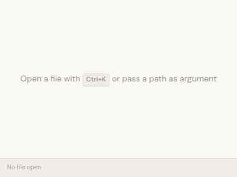
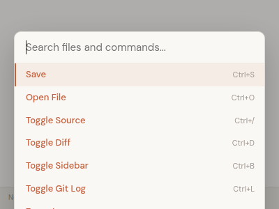
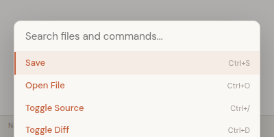
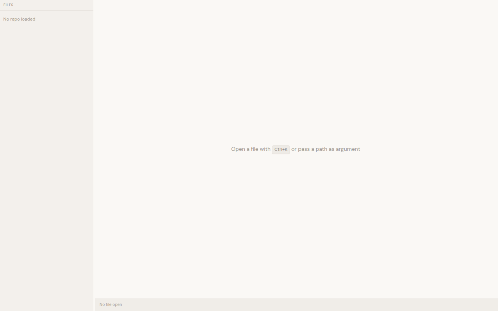

# Dogfood Report: mpad

| Field | Value |
|-------|-------|
| **Date** | 2026-03-09 |
| **App URL** | Tauri desktop app (tested via Vite dev server at http://localhost:5173) |
| **Scope** | Full app — empty state, command palette, sidebar, keyboard shortcuts, CSS, code-level review |

## Summary

| Severity | Count |
|----------|-------|
| Critical | 1 |
| High | 1 |
| Medium | 3 |
| Low | 2 |
| **Total** | **7** |

## Notes on Testing Approach

mpad is a Tauri v2 desktop app. Testing was performed in a headless cloud environment:
- **Vite dev server** at localhost:5173 for frontend testing via Puppeteer
- **TypeScript check + ESLint**: PASS (0 errors)
- **Vitest**: 55/55 tests pass (3 test files)
- **Cargo test**: 18/18 Rust tests pass
- **Code review**: All source files analyzed for behavioral bugs

Features requiring the Tauri runtime (file I/O, git operations, file watcher) could not be tested interactively. Issues for those areas were identified via code analysis.

## Issues

---

### ISSUE-001: Checked task list items become invisible and uninteractable

| Field | Value |
|-------|-------|
| **Severity** | critical |
| **Category** | ux / functional |
| **URL** | `src/styles/editor.css` lines 295-307 |

**Description**

When a user checks a task item in a task list, the CSS rule `.tiptap ul[data-type="taskList"] li[data-checked="true"]` applies `opacity: 0`, `max-height: 0`, `overflow: hidden`, and `pointer-events: none`. After a 400ms delay, the checked item fades out completely and becomes invisible and unclickable.

This means:
- Users cannot see what tasks they've completed
- Users cannot uncheck a task once checked (pointer-events: none)
- The only recovery is Cmd+Z undo, which users may not discover
- No visual indicator (like strikethrough) shows the item was completed before it vanishes

Expected behavior: Checked task items should remain visible with a visual indicator (strikethrough, dimmed text) and remain interactable for unchecking.

**Repro Steps**

1. Open a markdown file containing a task list (`- [ ] item`)
2. Click the checkbox to check the item
3. **Observe:** The item fades to opacity 0 over 400ms, then collapses to 0 height after 600ms. It becomes invisible and unclickable.

**Evidence** — CSS rule:

```css
.tiptap ul[data-type="taskList"] li[data-checked="true"] {
  opacity: 0;
  max-height: 0;
  margin: 0;
  padding: 0;
  overflow: hidden;
  pointer-events: none;
  transition:
    opacity 300ms ease 400ms,
    max-height 300ms ease 600ms,
    margin 300ms ease 600ms,
    padding 300ms ease 600ms;
}
```

---

### ISSUE-002: Command palette overflows viewport at small window sizes

| Field | Value |
|-------|-------|
| **Severity** | high |
| **Category** | visual / ux |
| **URL** | `src/styles/editor.css` lines 1001-1040 |

**Description**

When the window is small (e.g., 400x300 or 400x200), opening the command palette with Ctrl+K causes it to overflow the viewport. At 300px height, the palette extends 87px (29%) beyond the viewport bottom. At 200px height, it extends 172px beyond. Items at the bottom are completely inaccessible.

Root cause: `.palette-backdrop` uses `padding-top: 15vh` to position the palette, and `.palette-list` has `max-height: 340px`. Neither constraint accounts for the actual viewport height. The palette needs `max-height: calc(100vh - 15vh - input-height)` or similar.

**Repro Steps**

1. Resize the window to approximately 400x300
   

2. Press Ctrl+K to open the command palette
   

3. **Observe:** The palette extends beyond the viewport bottom, cutting off "Zoom In", "Zoom Out", and "Zoom Reset" commands
   

**Measurements:**
- At 400x300: palette height=342px, viewport=300px, overflow=87px (29%)
- At 400x200: palette height=342px, viewport=200px, overflow=172px (86%)

---

### ISSUE-003: `useTheme` hook leaks theme change listener on fast unmount

| Field | Value |
|-------|-------|
| **Severity** | medium |
| **Category** | functional / console |
| **URL** | `src/hooks/useTheme.ts` |

**Description**

The `useTheme` hook initializes a theme change listener asynchronously inside `setup()`, which runs without `await`. The cleanup function checks `if (unlisten) unlisten()`, but if the component unmounts before `setup()` completes (before the `await appWindow.onThemeChanged()` resolves), `unlisten` is still `null` and the listener is never cleaned up.

This causes a memory leak where the old theme change callback remains active after the component is gone. In practice this is unlikely to cause visible issues in a desktop app, but it violates React's cleanup contract.

**Evidence** — `useTheme.ts`:

```typescript
useEffect(() => {
    let unlisten: (() => void) | null = null;
    const setup = async () => {
      try {
        // ... async operations ...
        unlisten = await appWindow.onThemeChanged(({ payload }) => {
          applyTheme(payload); // <-- callback may fire after unmount
        });
      } catch { /* ... */ }
    };
    setup(); // <-- not awaited
    return () => {
      if (unlisten) unlisten(); // <-- may be null if setup hasn't finished
    };
  }, []);
```

**Fix:** Use an `isMounted` flag pattern:
```typescript
let mounted = true;
setup().then(() => { if (!mounted && unlisten) unlisten(); });
return () => { mounted = false; if (unlisten) unlisten(); };
```

---

### ISSUE-004: Sidebar shows empty area when repo has no markdown files

| Field | Value |
|-------|-------|
| **Severity** | medium |
| **Category** | ux |
| **URL** | `src/components/Sidebar.tsx` lines 218-222 |

**Description**

When a repository is loaded but contains no markdown files, the sidebar shows the repo name header and then a completely empty area. The "No repo loaded" message only appears when `!repoPath`, so the case `repoPath && tree.length === 0` produces no feedback.

Additionally, there is no loading state while `list_markdown_files` is being fetched — the sidebar briefly shows empty before files populate.

**Evidence** — `Sidebar.tsx`:

```tsx
{tree.length === 0 && !repoPath && (
  <div style={{ padding: '0.75em', color: 'var(--text-muted)' }}>
    No repo loaded
  </div>
)}
```

Missing case: `tree.length === 0 && repoPath` — should show "No markdown files found" or a loading spinner.

---

### ISSUE-005: CSS `h4` has duplicate `font-size` declaration (dead code)

| Field | Value |
|-------|-------|
| **Severity** | medium |
| **Category** | visual |
| **URL** | `src/styles/editor.css` lines 102-110 |

**Description**

The `.tiptap h4` CSS rule declares `font-size` twice. The first value (`1.05em`) is dead code, overridden by the second (`0.85em`). This makes h4 elements smaller than body text (intentional per the small-caps label design), but the first declaration is misleading and should be removed.

**Evidence:**

```css
.tiptap h4 {
  font-size: 1.05em;     /* ← dead code */
  font-weight: 500;
  text-transform: uppercase;
  letter-spacing: 0.04em;
  color: var(--text-secondary);
  font-family: var(--font-ui);
  font-size: 0.85em;     /* ← this wins */
}
```

---

### ISSUE-006: No keyboard focus management in empty state

| Field | Value |
|-------|-------|
| **Severity** | low |
| **Category** | accessibility |
| **URL** | `src/App.tsx` lines 271-278 |

**Description**

In the empty state (no file loaded), pressing Tab repeatedly keeps focus on `<body>`. None of the following actions are possible via keyboard alone:
- Opening the command palette (Ctrl+K works, but the kbd element isn't focusable)
- Reaching the status bar
- Navigating to any interactive element

The empty state `<kbd>Ctrl+K</kbd>` element is not interactive — it's just presentational text. Adding a clickable handler or making it a button would improve discoverability.

**Repro Steps**

1. Launch the app with no file argument
2. Press Tab repeatedly

3. **Observe:** Focus remains on `<body>` — no interactive elements receive focus

**Evidence:**

```
Tab order (10 presses):
  Tab 1: BODY — no interactive element
  Tab 2: BODY
  Tab 3: BODY
  ...
  Tab 10: BODY
```


---

### ISSUE-007: `write_file` Rust command uses non-atomic file writes

| Field | Value |
|-------|-------|
| **Severity** | low |
| **Category** | functional |
| **URL** | `src-tauri/src/commands.rs` lines 19-21 |

**Description**

The `write_file` command uses `std::fs::write()`, which overwrites the file in place. If the process crashes or system loses power mid-write, the file could be left in a partially-written state, causing data loss.

For a text editor, the standard approach is atomic writes: write to a temp file, then `rename()` it to the target path. This ensures the file is either fully written or unchanged.

**Evidence:**

```rust
pub fn write_file(path: String, content: String) -> Result<(), String> {
    std::fs::write(&path, &content).map_err(|e| format!("Failed to write {}: {}", path, e))
}
```

**Recommended fix:** Write to `{path}.tmp`, then `std::fs::rename()` to the final path.

---
